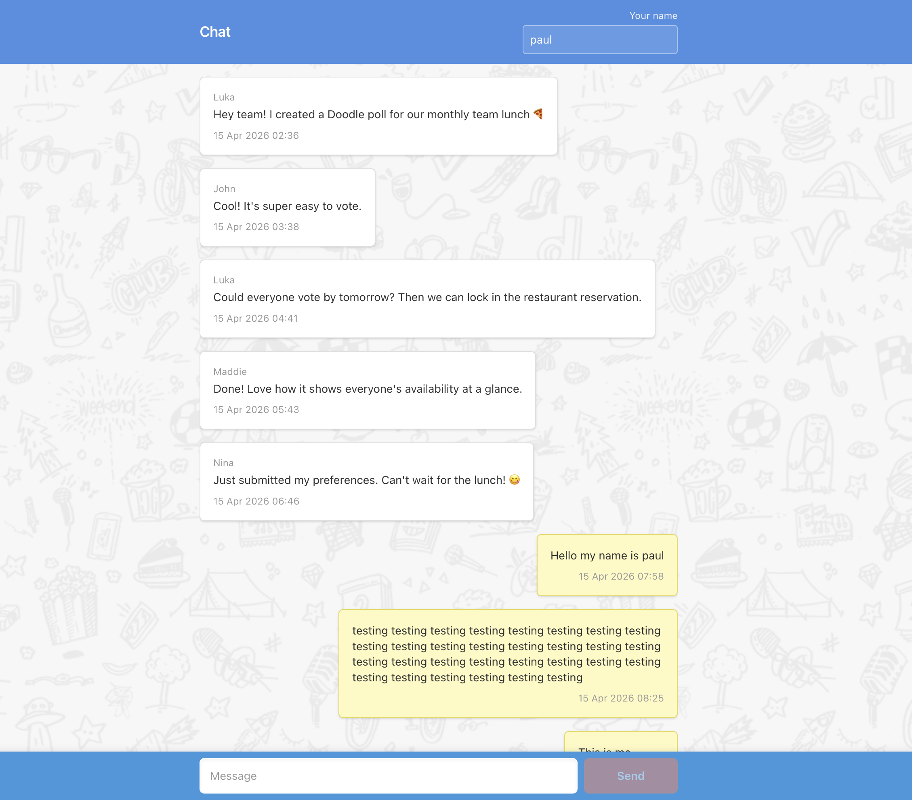

# Chat — Frontend challenge

A responsive chat UI built with **React**, **TypeScript**, **Vite**, **Tailwind CSS v4**, and **TanStack Query**. It lists messages from the challenge API and sends new messages with a Bearer token.

## Preview



## Prerequisites

- Node.js 20+ (recommended)
- The **Frontend Challenge Chat API** running locally (see the API repository README for install and `PORT`).

## Setup

1. Clone this repository and install dependencies:

   ```bash
   npm install
   ```

2. Copy environment variables:

   ```bash
   cp .env.example .env
   ```

   Edit `.env` so `VITE_API_BASE_URL` points at your API (e.g. `http://localhost:3000`) and `VITE_AUTH_TOKEN` matches the API’s expected Bearer token.

3. Start the app:

   ```bash
   npm run dev
   ```

4. Open the printed local URL (usually `http://localhost:5173`).

## Scripts

| Command | Description |
| --- | --- |
| `npm run dev` | Vite dev server |
| `npm run build` | Typecheck and production build |
| `npm run test:run` | Run tests

## Quality notes

- Added automated tests for core utility and chat message behavior.
- Improved accessibility across the chat flow with clear form labels, screen-reader friendly message announcements, and accessible button/input states.
- Added resilient UI states for loading, empty, and error/retry scenarios.
- Persisted the author name locally so users do not need to re-enter it on refresh.

## Architecture

- **`src/api/`** HTTP client with Bearer auth, message helpers, and `mapApiMessage` when the API shape differs from the UI types.
- **`src/hooks/`** `useMessages`, `useSendMessage`, `useLocalStorageAuthor` for display name and `author` on POST.
- **`src/features/chat/`** `ChatPage`, `MessageList`, `MessageBubble`, `ChatInput`, and related UI.
- **`src/assets/icons/`** Shared SVG icons used by chat components.
- **`src/utils/index.ts`** Shared helpers (`cn`, entity decode, dates, `isOwnMessage`, sort, errors).

## API notes

- `GET /api/v1/messages` supports optional query params such as `limit`, `after`, and `before`.
- `POST /api/v1/messages` expects JSON `{ "message": string, "author": string }`.
- All routes require `Authorization: Bearer <token>`.

## Author

Paul Ekunola
